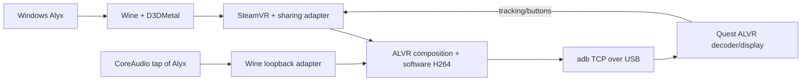

# Architecture and source map

[Русский](../ru/architecture.md) · [History](history.md)

`src/d3dmetal-native/` is the credited UTM MIT fork. `src/bridge/wine_bridge.cpp` attaches hooks to Wine-created D3DMetal devices, without initializing a second native GFXT host. FD/POD transport gives access to GPU-visible backing storage; the Unix broker does not copy every frame's pixels.

`dmn_kmtx.cpp` handles owner checks/GPU completion; `dmn_share_metal.mm` handles linear shared surfaces and first-use initialization. General NT handles/fences remain incomplete.

`alvr_error_bridge.cpp`, finger and trace modules are exact-layout guarded. Dormant activation-wait experiments remain off. Tracing/recording defaults off; the packaged trace trigger is confined to its private broker namespace.

`wine_audio_bridge.cpp` registers the guarded loopback table early, independently of graphics readiness. `src/scene/AudioSceneWatcher.exe` is built from source as an OpenVR Background observer; `GetCurrentSceneProcessId` selects the current game. `wine_scene_source.cpp` maps its Windows PID through the pinned Wine server protocol and checks native identity/start time/prefix. `src/bridge/audio/` owns a stable private CoreAudio tap/aggregate; it retargets only that game and leaves Mac playback unmuted. No game means an empty included-process list, not global capture. Microphone streaming is off.

Managed Wine Start/Stop/Reset and borrowed-buffer guards coordinate source changes. GetNextPacketSize slot 21 also polls scene discovery: CPAL checks packet size before GetBuffer, so an empty tap must not prevent discovery. Wine Stop is consumer quiescence, not proof that the HAL AudioUnit stopped. Source switches validate unchanged UID/ASBD and decline unsafe restarts. See [audio](audio.md). `source_ready_probe.cpp` is a legacy read-only metadata tool, not the normal selection path.

The Windows ALVR DLL remains the pinned vendor binary. `patches/` contains source equivalents, not a claim of a rebuilt shipped DLL. SW encoding still performs readback/color conversion/x264 all-I; a hardware VideoToolbox backend is not connected.

`alyx_macos/` contains paths/ownership, downloads, setup, configuration, runtime and CLI. `config/` has hashes, a portable session and two profiles. Private mutable state lives outside Git. See [development](development.md).
