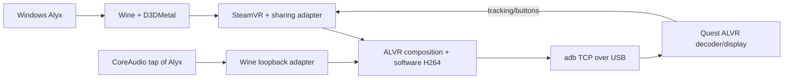

# Architecture and source map

[Русский](../ru/architecture.md) · [History](history.md)

`src/d3dmetal-native/` is the credited UTM MIT fork. `src/bridge/wine_bridge.cpp` attaches hooks to Wine-created D3DMetal devices, without initializing a second native GFXT host. FD/POD transport gives access to GPU-visible backing storage; the Unix broker does not copy every frame's pixels.

`dmn_kmtx.cpp` handles owner checks/GPU completion; `dmn_share_metal.mm` handles linear shared surfaces and first-use initialization. General NT handles/fences remain incomplete.

`alvr_error_bridge.cpp`, finger and trace modules are exact-layout guarded. Dormant activation-wait experiments remain off. Tracing/recording defaults off; the packaged trace trigger is confined to its private broker namespace.

`wine_audio_bridge.cpp` implements guarded loopback/process selection; `src/bridge/audio/` owns private CoreAudio tap/aggregate. Playback remains unmuted; microphone streaming is off. `src/probes/source_ready_probe.cpp` reads readiness without recording.

The Windows ALVR DLL remains the pinned vendor binary. `patches/` contains source equivalents, not a claim of a rebuilt shipped DLL. SW encoding still performs readback/color conversion/x264 all-I; a hardware VideoToolbox backend is not connected.

`alyx_macos/` contains paths/ownership, downloads, setup, configuration, runtime and CLI. `config/` has hashes, a portable session and two profiles. Private mutable state lives outside Git. See [development](development.md).
