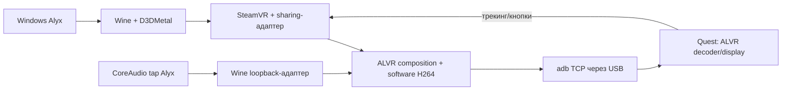

# Архитектура и исходники

[English](../en/architecture.md) · [История](history.md)

`src/d3dmetal-native/` — MIT-форк UTM с сохранённым авторством. `wine_bridge.cpp` подключает hooks к устройствам Wine/D3DMetal без второго native GFXT host. FD/POD даёт доступ к GPU-visible memory; broker не копирует все пиксели каждого кадра.

`dmn_kmtx.cpp` проверяет владельца/GPU completion; `dmn_share_metal.mm` создаёт линейные shared-поверхности и сохраняет peer-written pixels при первом использовании. Общие NT handles/fences неполны.

Error/finger/trace модули имеют exact-layout guards. Activation-wait эксперимент выключен. Трассировка/запись по умолчанию off; trigger ограничен приватным broker namespace.

`wine_audio_bridge.cpp` — guarded loopback/выбор процесса. `src/bridge/audio/` — private CoreAudio tap/aggregate. Mac playback сохраняется; microphone off. `source_ready_probe.cpp` читает готовность без записи.

ALVR DLL остаётся pinned vendor-бинарником. `patches/` — source equivalents, а не пересобранная DLL. SW encoder по-прежнему делает readback/конверсию/x264 all-I; hardware VideoToolbox не подключён.

`alyx_macos/` — paths/ownership, downloads, setup, configuration, runtime и CLI. `config/` — хеши, переносимая session и два профиля. Private mutable state вне Git. См. [разработка](development.md).
